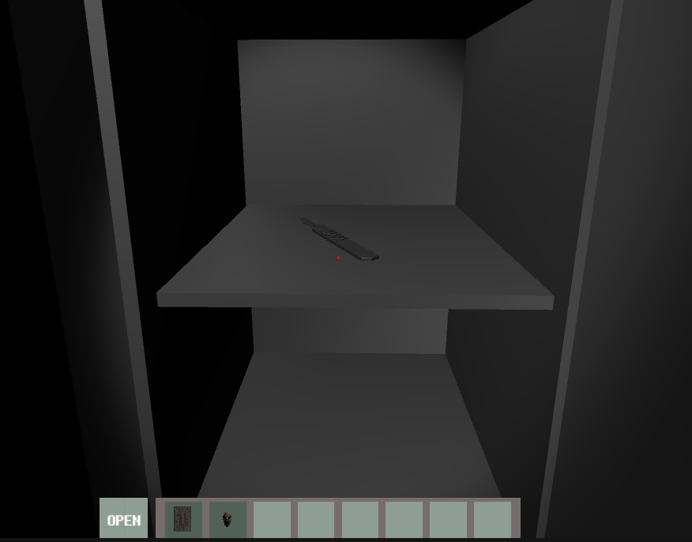

# Game Design Document (GDD) for "Night of Amnesia"

----------------

## Table of Contents

- [Latest Update note](#Latest-Update-note)
- [Game Overview](#Game-Overview)
- [Genre](#Genre)
  - [Primary Genre](#Primary-Genre)
  - [Sub genres](#Sub-genres)
- [Target Audience](#Target-Audience)
  - [Primary Demographic](#Primary-Demographic)
  - [Secondary Demographic](#Secondary-Demographic)
  - [Psychographics](#Psychographics)
  - [Geographics](#Geographics)
  - [Inclusion](#Inclusion)
- [Unique Selling Points](#Unique-Selling-Points)
- [Story and Narrative](#Story-and-Narrative)
- [Scripts with stage design](#Scripts-with-stage-design)
- [Gameplay and Mechanics](#Gameplay-and-Mechanics)
- [World design](#World-design)
- [Art and Audio](#Art-and-Audio)
- [Technology and Tools](#Technology-and-Tools)
- [Possible Challenges](#Possible-Challenges)
- [Team Communication, Timelines, and Task Assignment](#Team-Communication,-Timelines,-and-Task-Assignment)

------------------

## Latest Update note

Just incase if the marker can not finish the game on time, we provide the whole a detail guide from start to finish under **Scripts with stage design**❤❤

https://youtu.be/HAmuFwjq85Q And this is a video demonstrate a complete run guide for our game 

**Prototype 3 update 30/10/2023**

- Polish UI and sound effect though out the game
- Add more instruction dialogue in the actual gameplay
- Add more hint and add highlight of key element/task to be done
- Adjustment has been made base on the feedback received

**Prototype 2 update 8/10/2023**

- Now game can be play from start to finish
- highlight material shader now can only change the whole texture it is to be fixed in the future update
- hint board needs to be update in order to guide people
- responsive UI design needs to be address
- music needs to be add to different scene
- Game can only play in 20+ fps in browser if hardware boost has not been open

**Prototype 1 update 4/9/2023**

- Texture pack for map was delete to keep game under **250 MB** from **523MB** to now **146MB**

**Prototype 1 update** **3/9/2023**

- The scene will be located at Assets/Dnk_Dev/HospitalPack->**Map_Hosp1**
- We made the first room with the first event and finished the event up to Chapter 2
- player can move with WASD and use the mouse to change view just like every first-person game
- E is to interact with the doctor/item 
- Tab is to open the inventory bar, and time will not be paused when the player opens inventory (still counts toward the 5min mark)
- The player can now trigger a dead scene if they decide to interact with a doctor more than three times before taking the pill
- player can explore the room and interact with the items they see
- Sound hasn't been added to the prototype yet
- tested in WebGL. Everything in the game works fine
- The restart button has some issues to be fixed (might affect player experience)

-------------

## Game Overview

"Night Of Amnesia" thrusts players into a tale of memory loss and a desperate bid for freedom. Waking up in an eerie hospital with no recollection of your past, player are immediately confronted with a dual challenge: navigating the infinite long corridors filled with intricate puzzles and evading the ever-watchful eyes of a sinister doctor who seems hell-bent on ensuring the player never leave. As the clock ticks down, will the player unravel the mystery of your confinement, or become another lost soul in the annals of the hospital's dark history?

As to truly encapsulate the essence of a "Time survival" game, our game did integrate the element of time not just as a narrative device but as a core gameplay mechanic. Time should be a constant pressure on the player, influencing decisions, strategy, and the overall progression of the game. More detail will be introduced in **game mechanic section**.

----------------------------------------------------------------------------------------------------------------------------------------------------------------

## **Genre**👻

**Primary Genre:** 

- Time Survival Horror

Description: "Night Of Amnesia" is primarily a Time Survival Horror game. This means that while players will experience the atmospheric tension and fear commonly found in horror games, there's an added layer of urgency brought about by a constantly ticking clock. Players must not only navigate the game's challenges but do so within a set timeframe, making every decision and action crucial to their survival.

**Sub-genres:** 

- Puzzle, Adventure

Puzzle: Throughout the game, players will encounter various puzzles that they must solve to progress. These puzzles are intricately woven into the game's narrative and setting, requiring players to think critically and act swiftly.

Adventure: "Night Of Amnesia" also borrows elements from the adventure genre. Players will explore the eerie hospital, interact with objects and NPCs, and piece together the story behind their mysterious confinement.

Inspirations: Drawing inspiration from games like "Amnesia," "Outlast," and "Granny," "Night Of Amnesia" combines the best elements of horror, puzzle-solving, and time-based challenges to create a unique and suspenseful gameplay experience.

----------------------------------------------------------------------------------------------------------------------------------------------------------------

## Target Audience

**Primary Demographic:**

- **Age Range:** 18-35 years old. This age group is most likely to be attracted to survival horror games with intricate puzzles and a mature storyline.
- **Gaming Experience:** Intermediate to Advanced. Given the game's complexity, especially with the time-survival mechanics and intricate puzzles, it's best suited for players who have some experience with gaming and enjoy challenges.
- **Interests:** Fans of psychological thrillers, horror genres, and puzzle-solving games. Players who appreciate a deep narrative intertwined with gameplay mechanics.
- **Platform Preference:** PC and Console gamers. While the game can be adapted for mobile, the immersive experience is best delivered on larger screens with dedicated gaming hardware.

**Secondary Demographic:**

- **Age Range:** 36-50 years old. Older gamers who have a penchant for narrative-driven games and have experience with classic survival horror titles.
- **Gaming Experience:** Casual to Intermediate. This group might appreciate the storyline and atmosphere more than the challenging mechanics, so an "easy mode" or "story mode" might appeal to them.
- **Interests:** Players who enjoy story-rich games, mysteries, and atmospheric settings. They might not be hardcore horror fans but appreciate a good suspenseful tale.

**Psychographics:**

- **Challenge Seekers:** Players who thrive on overcoming obstacles and solving intricate puzzles under pressure.
- **Story Lovers:** Gamers who get deeply involved in game narratives and appreciate well-developed backstories and character arcs.
- **Thrill Enthusiasts:** Those who enjoy the adrenaline rush from horror and suspense elements.

**Geographics:**

- While "Night Of Amnesia" can appeal to a global audience, special attention should be given to markets where survival horror games have traditionally performed well, such as North America, Europe, and parts of Asia like Japan.

**Inclusion:**

- The game should be designed keeping in mind inclusivity. Features like adjustable difficulty levels, subtitles, and accessibility options can make the game appealing to a broader audience.

----------------------------------------------------------------------------------------------------------------------------------------------------------------

## Unique Selling Points

1. **Time-Survival Mechanic:** Unlike traditional survival horror games, "Night Of Amnesia" integrates a time-based survival mechanic, where players are not just evading threats but also racing against the clock. This adds an extra layer of tension and urgency to the gameplay.
2. **Dual Reality Gameplay:** The game seamlessly transitions between the real world and a mirrored reality, challenging players to adapt and think differently about their surroundings. This duality offers a fresh twist on environmental puzzles and narrative progression.
3. **Deep Narrative:** The story isn't just about escape but delves into themes of memory, identity, and the psychological effects of confinement. This rich narrative is woven intricately with gameplay elements, making for a compelling gaming experience.
4. **Adaptive Antagonist:** The mysterious doctor doesn't just follow a set pattern. He adapts to the player's actions, making each playthrough unique and unpredictable.
5. **Innovative Puzzles:** Drawing from the dual-reality mechanic, puzzles in "Night Of Amnesia" require players to think across both realms, combining clues and items from each to progress.
6. **Atmospheric Design:** The eerie hospital setting, combined with top-notch sound design and visuals, immerses players in a world that's both hauntingly beautiful and terrifying.
7. **Intricate Character Interactions:** NPCs in the game are not just quest givers or obstacles. Interacting with them reveals deeper layers of the story and can even influence the game's outcome.
8. **Accessible to Various Skill Levels:** While the game is challenging, it's designed to be accessible to both seasoned gamers and those new to the survival horror genre, thanks to adjustable difficulty settings.
9. **Morse Code Integration:** By incorporating Morse code as a puzzle element, the game introduces an educational aspect, teaching players a real-world skill in a fun and engaging manner.

----------------------------------------------------------------------------------------------------------------------------------------------------------------

## **Story and Narrative**

**Characters**

- Player: A person who wakes up in a mental hospital with no memory of how they got there.
- Doctor: A mysterious figure who seems pleased that the player is taking their medication on time.
- Patients : NPC who can interact with player and trigger certain events.

### **Prologue:**

In the dimly lit confines of an unfamiliar room, players awaken with a jarring sense of amnesia. The only clues to their identity and past are a few white pills and a medical record on a table. The record hints at a forgotten past and a mysterious ailment that has robbed them of their memories.

### **Chapter 1: The Awakening**

The initial interactions teach players the game mechanics. A mysterious doctor enters, urging the player to take their medication. Compliance leads to praise, but the true objective becomes clear: escape. A key left carelessly by the doctor becomes the first puzzle, teaching players about stealth and the importance of timing. Using a wire found in the room, players fashion a makeshift key, unlocking the door and their first taste of freedom.

### **Chapter 2: Dual Realities**

Emerging into a corridor, players encounter a child NPC who dismisses them curtly. As they progress, the environment subtly shifts, introducing the mirrored reality mechanic. This alternate world is a distorted reflection of the real one. Players must navigate between these realities, interacting with the mirrored NPC to unravel the mystery of the looping corridor. The climax of this chapter centers around a card game with the NPC, where the key to progression is found in the mirrored world: a flying card.

### **Chapter 3: The Surgery of Truth**

Armed with the flying card, players delve deeper into the mirrored world, arriving at a surgery room. Here, they find a doctor, eerily inert, his face obscured by a mask. Interacting with the mask allows players to toggle between realities. A Morse code puzzle, hinted at by flashing lights, becomes the central challenge. Solving it by combining clues from both realities rewards players with a surgical knife, a tool and weapon for the final confrontation.

### **Final Chapter: Breaking the Loop**

The climax is a tense cat-and-mouse chase in the looping corridor. The doctor, now an active threat, hunts the player. Using the corridor's looping nature and the surgical knife, players must outwit and ultimately confront their pursuer. Upon defeating the doctor, a momentary sense of victory is felt. However, a twist reveals that the true antagonist is the child NPC from Chapter 2, suggesting deeper layers to the narrative and setting up potential sequels or expansions.

### **Epilogue:**

The game concludes ambiguously. Did the player truly break free from the loop, or are they trapped in an endless cycle of amnesia and pursuit? The narrative leaves room for interpretation, encouraging discussions and theories among the player community.

Throughout "Night Of Amnesia," the narrative intertwines with gameplay mechanics, ensuring that story progression feels organic. The dual realities not only serve as a gameplay challenge but also symbolize the fragmented state of the player's memory. The looming time mechanic, ever-present, adds urgency to the narrative, reinforcing the themes of survival and the fleeting nature of memory.

**Item list:**

| Name        | Image                                                        | Description                                                  |
| ----------- | ------------------------------------------------------------ | ------------------------------------------------------------ |
| Clipboard   |          | A message on it. Use for providing some information for the player. |
| Pills       |                   | Placing on the small desk beside the bed in the first room. Player must use the pill after the doctor asks player to take medicine. |
| Key         |                      | The doctor forgets to take out the key on the door. Before the doctor comes back and takes it, player has to take out the key, memorize the key shape and put it back. |
| Wire        |                    | Tie around bed leg. Use to create the key shape and escape from the first room. |
| Flying card |  | Get from the kid in mirrored world to solve the tarot cards puzzle. Besides, use it before mask to toggle between the real and mirroed world. |
| Mask        |                    | Obtain from the doctor in third room. Use to toggle between the real and mirrored worlds. |
| Knife       |                  | Inside the safe box. Player use knife to kill the doctor.    |

-------------------------

## **Scripts with stage design**

Each stage would integrate a time limit, player must do certain event within certain time in order to progress the game

### Chapter 1: Night of Amnesia

**Setting:** The player awakens in an unfamiliar room. A table stands in the center, bearing white pills and a clipboard showing a bit background of the storyline.

**1. Secrets of the Medical Record**

- **Interaction:** The player has the option to inspect the medical record.
- **Outcome:** The record reveals the player's amnesia backstory, providing context for the unfolding narrative.

**2. The Doctor's Visit**


- **Trigger:** The player attempts to interact with the door.

- **Interaction:** The doctor enters, urging the player to take the medication.

- **Purpose:** This is to get player to be familiar with how to interact with item and how to use item in inventory

- Choices:

  - A.

    Following the doctor's advice, the player picks up and consumes the pill from the table.

    - **Outcome:** The doctor commends the player's compliance and leaves the room to patrol.

    

  - B.

    The player chooses not to take the medication.

    - **Outcome:** The doctor's will execute player when player refuse to take medication three times in a row.

    

**3. Opportunity with the Key**

- **Trigger:** After the doctor departs.

- **Interaction:** The player notices a key on the door.


- Choices:

  - A.

    The player attempts to stealthily take the key and make an escape.

    - **Outcome:** This triggers a bad ending where the player is caught and meets their demise at the hands of the doctor.

    

  - B.

    The player decides to memorize the key's shape and then carefully places it back.

    - **Outcome:** Upon the doctor's return from his patrol, he praises the player for staying put and continues his rounds.

    

**4. The Beginning of the Escape**

- **Trigger:** The doctor exits once more, shutting the door behind him.

- **Interaction:** The player discovers a piece of wire hidden in the corner of the bed.

- Choices:

  - A.

    Using the wire, the player tries to mimic the shape of the key they remembered earlier to unlock the door.

    - **Outcome:** The player successfully opens the door, concluding Chapter 1 and paving the way for the subsequent chapter.

    

  - B

    The player did not mimic the correct shape they will not be able to escape

    - **Outcome**: The player failed to open the door, **Gameover scene** trigger

    

-----------------------------

### Chapter 2: Reality and Reflection

**Setting:** The player exits the room, stepping into a seemingly endless corridor.

**1. The Child's Indifference**

- **Trigger:** As the player reaches the midpoint of the corridor.

- **Interaction:** The player encounters a child NPC.


- Choices:

  - A.

    The player opts to engage the child in conversation.

    - **Outcome:** The child responds with detachment, suggesting there's nothing worth discussing and dismisses the player.

  

**2. Revelations of the Mirrored World**

- **Trigger:** The player continues their journey.

- **Interaction:** Unbeknownst to the player, they suddenly transition into the mirrored world.

- **Discovery:** The player realizes that the NPC's room, which was initially on the left, now appears on the right.

- Choices:

  - A.

    The player decides to converse with the mirrored NPC.

    - **Outcome:** The mirrored NPC informs the player that they don't belong here and are trapped in an endless loop. To seek answers, they should attempt to play cards with their real-world counterpart.

**3. The Card Game Challenge**

- **Trigger:** The player reverts to the real world.

- **Interaction:** The player engages in dialogue with the child NPC once more.

- Choices:

  - A.

    

    The player selects one card out of three presented options.

    - **Outcome:** Regardless of the player's choice, it will always be incorrect. After three consecutive wrong choices, the NPC informs the player that they've run out of chances.
    - 

**4. Truth of the Reflection**

- **Trigger:** The player re-enters the mirrored world.

- **Interaction:** The player converses with the mirrored NPC.

  

- **Outcome:** The mirrored NPC bestows upon the player a "flying card."

  

**5. Escaping the Loop**

- **Trigger:** The player acquires the flying card.

- **Interaction:** The player utilizes the flying card.

- **Outcome:** Successfully breaking free from the loop of reality and reflection, the player advances to Chapter 3.

  

------------------------

### Chapter 3: Morse Code and the Truth

**Setting:** The player is situated in the operating room of the mirrored world.


**1. The Secret of the Mask**

- **Trigger:** Upon entering the operating room.

- **Interaction:** The player discovers a doctor lying on the operating table.

- Choices:

  - A.

    

    The player decides to interact with the doctor's mask.

    - **Outcome:** The player successfully removes the doctor's mask.

**2. The Challenge of Morse Code**

- **Trigger:** After the removal of the doctor's mask.

- **Interaction:** The lights in the operating room begin to flicker, revealing Morse code sequences.

  

- **Hint:** A chalkboard in the operating room provides clues about the Morse code.

**3. The Power of the Mask**

- **Trigger:** The player is in possession of the doctor's mask.
- **Interaction:** Each time player use card and use mask, the player can toggle between the real and mirrored worlds.
- **Objective:** The player must seek clues for the code within both dimensions.
- 

**4. The Decryption Challenge**

- **ETrigger:** The player uncovers code hints from both worlds.

  

- Codes:

  - Mirrored World Code: 8528
  - Real World Code: 2885

- Choices:

  - A.

    

    The player inputs the correct combination.

    - **Outcome:** The safe in the real world opens, granting the player access to a scalpel.

**5. Journey to the Finale**

- **Trigger:** The player acquires the scalpel.

- **Interaction:** The player progresses, seeking out the doctor.

  

-------------

### Finale: The End of the Loop

**Setting:** With scalpel in hand, the player enters a seemingly familiar corridor.

**1. The Secret of the Portal**

- **Trigger:** The player obtains the scalpel.

- **Interaction:** The player approaches and enters the portal, finding themselves back in the looping corridor from Chapters 1 and 2.

  

**2. The Doctor's Pursuit**

- **Trigger:** The player enters the corridor loop.

- **Interaction:** The player interacts with the child NPC. The child NPC will shouting out loud for helping the player to seek the doctor's attention. 

  

- Choices:

  - A.

  - 

    The player decides to move toward in front of the doctor.

    - **Outcome:** The doctor kills the player.

  - B.

    

    The player chooses to use the corridor's looping mechanism, move behind the doctor.

    - **Outcome:** Utilizing the corridor's looping mechanism, the player successfully approaches the doctor from behind and uses the scalpel to attack.

**3. The End of the Loop**

- **Trigger:** The player successfully attacks the doctor.

- **Interaction:** The screen displays "congrats you finally break the loop".

  

- **Continuation:** After a few seconds, the screen displays "or... did you?".

**4. The True Enemy**

- **Trigger:** The screen displays "or... did you?".

- **Interaction:** The player is transported to the NPC room from Chapter 2.

- **Reveal:** The player discovers that the true final boss is the NPC from Chapter 2.

  

This finale chapter provides a twist, revealing that the seemingly helpful NPC from Chapter 2 is the actual antagonist, which could provide a shocking and unexpected turn of events for the player. This could be a compelling way to wrap up the game, leaving room for potential sequels or alternative endings that could be explored in future game developments or updates.

----------

## **Gameplay and Mechanics**

1. **Player Perspective**
   The game is experienced from a first-person perspective, immersing the player directly into the eerie atmosphere of the hospital. The camera is fixed, ensuring that the player's focus remains on the immediate environment and the challenges ahead. The player character remains non-visible on screen, further emphasizing the feeling of vulnerability and anonymity.

Example of player view


1. **Controls**

   

   - Movement: WASD keys
   - Interact: E key
   - Inventory: Tab key
   - Use Item : Left click (When inventory is open and mouse pointing to the item)

2. **Progression**

   The player's journey is a race against time. They must solve intricate puzzles and make critical decisions within a set time frame to escape the hospital's clutches. Failure to act promptly or making erroneous decisions can lead to dire consequences, including being caught by the doctor or facing other deadly outcomes.

3. **Gameplay Mechanics**

   - **Time-Sensitive Actions:** The game's core survival mechanic revolves around time. Every second counts. Whether it's solving a puzzle, evading the doctor, or making a crucial decision, the player's survival hinges on their ability to think and act swiftly.
   - **Inventory Management:** The player will come across various items like wires, pills, and keys. These items are not just collectibles but essential tools for survival. Using them at the right moment can mean the difference between life and death.
   - **Environmental Awareness:** The hospital is filled with both dangers and opportunities. Players must be observant, using the environment to hide, find alternative routes, or even set traps for the pursuing doctor.
   - **Decision-Driven Outcomes:** Choices matter. The decisions players make, both big and small, will influence their survival chances and lead to different game endings. This adds replay value and emphasizes the importance of strategy in this survival game.

------------------------

## **World Design**

Actual game map looks like updated in 8/10/2023


**Game World**🌏
The game is set in a 3D mental hospital room with minimal furniture. We plan to set the game to achieve some kind of infinite loop, where player infact can never escape from this mental hospital, where we've plan to set the map as a circle where when the player walks from one end of the corridor to the other, player will realize they were just entering the same space.

<p align="center">    </p>

The world will be break down to four separate part:

- Spawn Room of player
- Room with npc to play card
- Corridors
- The locker room/surgery room

----------

1. **Spawn room**


The first room where the player finds themselves serves as an escape room with a twist. It's a dark, windowless space lit only by the light filtering through a grated door. The room's architecture is designed to make the player feel confined and unaware of their location.


**Objects:**

- **Table**: The only table in the room contains the first clue about why the player is there and what they must do to escape.

- ~~**Toilet**: Adds to the unsettling atmosphere and serves no gameplay function.~~

- **Bed**: Serves as the respawn point for the player each time they "wake up."

   

**Lighting:**
The room has no inherent light sources. The only light comes from the outside, filtering through the grates on the door, making everything look shadowy and uncertain.

---------------------

2. **Room with NPC to play card**

This room serves as a pivotal point in the player's journey, introducing them to the mysterious NPC and the card game that holds the key to progressing further. The room's design is meant to evoke a sense of intrigue and challenge.


**Objects:**

- **Table**: Positioned in the room door, this table serves as the focal point. It's an old, wooden table, worn out from years of use, hinting at the countless games played upon it. On the table lies a deck of cards, neatly stacked, and three face-down cards placed in front of the NPC, waiting for the player's choice. 
- **NPC**: The mysterious figure stands patiently, shrouded in dim light. Their features are hard to discern, adding to their enigmatic presence. Their eyes, however, are fixated on the player, awaiting their move.

**Lighting:** The room is dimly lit, with a single overhead light casting a focused glow on the table, making the card game the center of attention. The rest of the room fades into semi-darkness, with the corners and edges shrouded in shadows, adding to the room's mysterious ambiance.

**Ambiance:** The room is silent except for the soft shuffling of cards and the occasional creak of the wooden floor. The air is thick with tension, as the player realizes the importance of the game they're about to play.

---------------------

3. **The Corridors**
   The corridors are narrow, dimly lit, and confusing, designed to disorient the player. Sounds of footsteps or distant screams occasionally echo.


**Objects:**

- Doors: Some locked, some open, leading to various rooms or closets.
- Tunnel Lights: slightly dim, adding horror vibe to the atmosphere.

**Gameplay Mechanics:**

- Player must navigate through the maze-like corridors to reach different areas.
  Some doors require keys or solving puzzles to open.

---------

4. **The Locker Room/Surgery Room**
   The Locker Room is where the doctor and some patients keep their personal belongings. It's a place of potential clues and discoveries.


**Objects:**

- Lockers: Some are locked and require combinations or keys.
- Lost & Found Box: Might contain useful items or clues.
  Gameplay Mechanics:

**Gameplay Mechanics:**

- Player can search lockers for clues, items, or keys.
  Some lockers might have puzzles that need to be solved to be opened.

-----------------

## **Art and Audio**

### **Art Style**
The art style is dark and realistic to set the mood of a horror-based mental hospital.

 Drawing inspiration from "Granny", the game embraces a gloomy and vintage aesthetic.


### **Sound and Music**
Screams, footsteps, and eerie background music will be used to enhance the horror atmosphere.

- The game's background music becomes increasingly sharp as the timer runs down, ratcheting up the tension.
- Footsteps and environmental sounds play a crucial role, signaling the approach of dangers or hinting at solutions.

### **Sound Design**: 

- The game's background music becomes increasingly sharp as the timer runs down, ratcheting up the tension.
- Footsteps and environmental sounds play a crucial role, signaling the approach of dangers or hinting at solutions.

### **Background Music**

The background music for the game maintains a consistent theme centered around a feeling of oppression and tension. A 5-minute loop is designed to immerse the player in the game's heavy atmosphere.

### **Key Moments for Enhanced Sound Effects:**

- Digital sound effect for morse code to let player know better
- Jump scare sound effect when player was dead

### **Sound Design**

#### **inital design**

Sample Music : (https://www.youtube.com/watch?v=H0SZF77hZ_g&ab_channel=PXLPLAYS)

1. ~~Toilet Flushing: To add realism when the player interacts with the toilet.~~
2. ~~Vomiting Sounds: To make the act of purging more visceral.~~
3. ~~Alarm Sounds: Heard during specific events to heighten tension.~~
4. ~~Lock-Picking Sounds: When the player is using tweezers to pick a lock.~~
5. ~~Getting Out of Bed: To signify the player's 'rebirth' in the game.~~

#### **Final stage design**

Back ground music used was download from unity asset

Pixel sound effect was added for each dialogue 

Morse code sound effect was added for player to better track the passcode in the final scene

#### **User Interface (UI) Sounds**

Special sound effects are assigned to UI interactions to make the interface more engaging:

1. Opening the Backpack: A zipper or velcro sound to signify the action.
2. Storing or Retrieving Items: A soft thud or click to denote the act.


----------------------

## **User Interface (UI)**

The UI will include an inventory screen, a red dot pointer indicating the sight for player, and red dot will change when player point into something that can be interact with.

### **Red dot** **shown in the center**


### **When pointing to interactable item**


In order to make player less confuse and make the game easier to play, we've also add a simple shader effect to highlight the item player chose （white pill become red when pointed）


### **Inventory System: Quick-Access Item Bar**

Rather than a traditional backpack or inventory screen, the game employs a quick-access item bar similar to that in Minecraft. This feature is designed for rapid, real-time item use.

### **Item bar in minecraft:**


### **Our item bar**:


### **Functionality:**

- Limited Slots: The quick-access bar has a limited number of slots to hold items. This forces the player to make strategic decisions about what to carry.
- Real-Time Access: Items can be used directly from the quick-access bar without navigating through multiple menus, making it easier to react quickly to in-game events.
- Backpack status: the left side of the inventory bar has a small icon indication whether or not the inventory bar is open/close.

### **Interactions:**

- Tap to Select: Players tap the item slot in the inventory bar to quickly select items.
- Instant Use: The selected item can be used instantly by clicking a left click button, allowing for quick and timely actions in stressful situations.

### **Item Descriptions:** 

When an item was interact by player, a small tooltip will appear, providing a brief description of the item and its usage.


**Example:**

```
Iron Wire: This wire looks like it can be easily bend into other shapes

White Pill:A white pill, it looks ordinary, but I don't think anyone would want to swallow it.
```

--------------

### **Main Menu**

- #### **Components:**

  - Start: To start a new gameplay session.
  - Background animation : To drag player's attention into the game

### **Art Style:**

#### **Design since Project 1**

1. Aesthetic: The UI maintains the game's art style, focusing on a horror atmosphere. The buttons might have a distressed, aged look, and the background could be a dimly lit room or corridor in the asylum.

2. Font: A slightly jagged, distressed font to go along with the horror theme.(Example provide below)

   

#### **Design update in project 2**

The overall UI now follows a pixel style with the title still focusing on horror atmosphere, dialogue in pixel font and sound effect will provide more retro and RPG type of vibe to let player focus more in the game content and not breaking the horror theme in the same time. 

In addition, we made the start menu in animation for better fit in the endless corridor theme of our game.


---------

## **Technology and Tools**

**Game Engine**:

- **Unity**: The game will be developed using Unity, as it provides a powerful and flexible platform for game development and is compatible with WebGL.

**Asset Libraries**:

- **Unity Asset Store**: For sourcing pre-made assets that fit within the game's aesthetic.
- **Sketch fab**

**Version Control**:

- **Github**: For version control and collaborative work.

**3D Modeling**:

- **Blender**: For creating custom 3D models and animations.
- **Maya**

**Music and Sound Design**:

- Unity asset store
- Free music resource from Youtube

------

## **Possible Challenges**

**Storage Limitations**

- **Asset Size**: Given that the game will run in a web browser, there's a need to keep the overall file size as small as possible to ensure quick load times.
- **Solution**: Carefully select and possibly compress high-quality assets. Regularly test the game to make sure it stays within the acceptable size limits.

**Timeframe Limit**

- The game was designed to let normal player escape in 5min, however, player time would be difficult to control as different player with have different play time, as we have small quiz and puzzle to solve.

**Work integration**

- It is hard to integrate our game project in Github when multiple teammate during the development process the game, the Github require constant merge conflict and issues and significantly drag down the efficiency of our project development. 

**Design process**

- Due to the technical issues, it is hard to maintain both rationale and entertain player at the same time, there could be many potential bug issues arise during play time.

---------------------

## **Team Communication, Timelines, and Task Assignment**

Communication Channels

| Channel      | Purpose                                         |
| ------------ | ----------------------------------------------- |
| Slack+Wechat | progress updates, casual conversations.         |
| Zoom         | Weekly team meetings, critical discussions.     |
| Email        | Formal communications, updates to stakeholders. |
| GitHub       | Code reviews, pull requests, issue tracking.    |

**Timelines**

| Weeks | Milestones                   | Objectives                                   |
| ----- | ---------------------------- | -------------------------------------------- |
| 3-5   | Conceptualization & Planning | Finalize GDD, choose technologies            |
| 5-7   | Development - Phase 1        | Implement core mechanics, develop basic UI   |
| 7-9   | Development - Phase 2        | Implement advanced features, initial testing |
| 10-11 | Testing & Debugging          | Conduct beta testing, debug and fix issues   |
| 12    | Final Week                   | Final testing and QA, submission for review  |

**Task Assignment - Trello Categories**

| Category    | Description                                                 |
| ----------- | ----------------------------------------------------------- |
| To Do       | Tasks that need to be done.                                 |
| In Progress | Tasks that are currently being worked on.                   |
| Done        | Completed tasks.                                            |
| Blocked     | Tasks that can't proceed until some other task is complete. |

**Responsibilities**

| Role        | Responsibilities                         | Name         |
| ----------- | ---------------------------------------- | ------------ |
| Team Lead   | Oversees the project, general management | Langze Lu    |
| Developer 1 | Core mechanics and UI                    | Yutian Fan   |
| Developer 2 | Advanced features, physics               | Rong wang    |
| QA Engineer | Testing and quality assurance            | Langze Lu    |
| Designer    | Game art and animations                  | Jing Yun Tan |

**Meetings**

| Frequency       | Purpose                                                      |
| --------------- | ------------------------------------------------------------ |
| Weekly Meetings | Detailed discussions on project status, blockers, and next steps |

---------------

