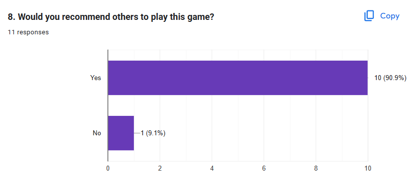

# Project 2 Report

Read the [project 2
specification](https://github.com/COMP30019/Project-2-Specification) for
details on what needs to be covered here. You may modify this template as you see fit, but please
keep the same general structure and headings.

Remember that you must also continue to maintain the Game Design Document (GDD)
in the `GDD.md` file (as discussed in the specification). We've provided a
placeholder for it [here](GDD.md).

## Table of Contents

* [Evaluation Plan](#evaluation-plan)
* [Evaluation Report](#evaluation-report)
* [Shaders and Special Effects](#shaders-and-special-effects)
* [Summary of Contributions](#summary-of-contributions)
* [References and External Resources](#references-and-external-resources)

-------------------

## Evaluation Plan

### **Evaluation Techniques:**

**Querying Technique - Questionnaire:** After participants play the game, they will be given a questionnaire to fill out. This will help us understand their experience, what they liked or disliked, and any suggestions they might have.

**Observational Technique - Think Aloud Protocol:** Participants will be asked to verbalize their thoughts while playing the game. This will give us insights into their decision-making process, areas of confusion, and moments of delight or frustration.

### **Tasks for Participants:**

1. Navigate through the game's initial room and interact with objects.
2. Engage with the NPC in the card game room.
3. Attempt to solve puzzles and progress through the game.
4. React to the game's narrative twists and turns.

### **Participants:**

**Recruitment:** We will recruit participants through friends and family, consider classmate for COMP30019. 

**Qualifying Criteria:** Participants should be within our target audience age range and have some experience with survival horror games.

### **Data Collection:**

**Data Being Collected:**

- Player's overall experience and satisfaction.
- Points of confusion or difficulty.
- Feedback on game mechanics and narrative.
- Suggestions for improvement.

### Tools Used: 

Google Forms for questionnaires and screen recording software for the Think Aloud Protocol.

### Data Analysis:

**Analysis Method:** We will use qualitative analysis for feedback and suggestions. For quantitative data like ratings, we'll use statistical analysis to find averages and trends.
Metrics: Player satisfaction rate, completion rate, points of major drop-offs or difficulties, and frequency of specific feedback or suggestions.

### Timeline:

**Evaluation Period:** 2 weeks from the start date.

**Data Analysis:** 1 week post-evaluation period.

**Game Changes Implementation:** 1-2 weeks post data analysis.

------------------------

## Evaluation Report

From **milestone1's evaluation plan**

### Querying Technique

We had come up with a questionnaire to improve our game design progress

The form below summarized the question we plan to ask the participant

---------------------

## Question 1 : Please rate our game in terms of difficulty

- [ ] 1 (Really easy)
- [ ] 2 (Relatively easy)
- [ ] 3 (Normal)
- [ ] 4 (Quiet challenging)
- [ ] 5 (Impossible to beat)

## Question 2: What do you think of our UI design and graphic design?

- [ ] 1 (Very dissatisfied)
- [ ] 2 (Somewhat dissatisfied)
- [ ] 3 (Neutral)
- [ ] 4 (Somewhat satisfied)
- [ ] 5 (Very satisfied)

## Question 3: How would you rate the shaders and special effects used in the game?

- [ ] 1 (Very Poor)
- [ ] 2 (Poor)
- [ ] 3 (Average)
- [ ] 4 (Good)
- [ ] 5 (Excellent)

## Question 4: Do you think these special effects help the overall visual presentation of the game?

- [ ] Yes
- [ ] No

## Question 5. Do you agree that the game commands are easy to learn and use?

- [ ] Yes
- [ ] No

## Question 6. Do you think you can complete the game within 5 minutes?

- [ ] Yes
- [ ] No

## Question 7. Based on your answer to the previous question, please provide your reasons and opinions.

Your response: 

## Question 8. Would you recommend others to play this game?

- [ ] Yes
- [ ] No

## Question 9. What improvements or suggestions do you have for the game?

Your suggestions: 

-----------------------

We made few adjustment base on the **querying feedback** we got:

**Game design feedback**

We have total 11 participants to join our questionnaire, over 50% of the participants response that our game is harder than expect and over 60% of the participants tick no when asking if they can complete the game within 5 minutes. Based on the response for question 7, we noticed many of player were complaining about lack of guidance and short time limit to complete the actual game, we have come to two main solution to improve the game design:

1. Adding UI: Most of the play testers have given feedbacks on our UI is not good enough and confused a lot on the "Tab" and "E" keys. Play testers reflected that there is no clear activation effects or icons that indicating the player is using the inventory. To resolve this problem, we have added "Open" and "Close" icons to indicate the inventory use status. We believe this change could help the player on performing the command keys "Tab" and "E" accurately and provide a better player experience. We've also add a player movement guide at the start of the game play to make sure player knows what to do.
2. Hints: Over half of the play testers have reflected that our game is too hard due to the limited hint and brought them confusion on progressing the game. Therefore, we have added more hints into the dialogue. Moreover, few objects and sound also use as hint components into the game. We believe that by adding more hints, the difficulty of the game has been reduced and the player is able to complete the game easier within 5 minutes time frame.

There was a significant improvement when we implement the improved UI and dialogue system.

**Visual feedback**

Visual feedback we got was more favorable compared to game design feedback, most people though our overall visual design was average/above average with some suggestion like highlight colour not too visible and fix UI design to make it fit more to the game theme itself.

Base on the feedback we plan to improve our game in two area

1. **Highlight effect:** When player points to a item that can be interact, the material to change to red to be more noticeable.
2. **UI Design:** Plans to enhance visual appeal by improving UI design, including text color highlighting for clearer hints.

------------------------

### **Observational Technique** 

**Think Aloud Protocol:** We have conducted few playtests in private. During the playtesting, participants play the game one by one and we, the game developers will staying besides them. We will first observed the reaction of the playtester without providing any hints and record their reaction and comment during the gameplay. If the playtester could not make any progression at all, we will first provide some hints. Furthermore, if the playtester still confused, we will guide them the correct method to progress the game. At this moment, we will record the count of hints that we have provided. Moreover, when the playtester has completed the game, we will ask questions about their game experience and feedback on the game. 

Below is one of our recording on a playtester:

| Participant | Scene Description            | Comment (during playtest)                 | Hint Count | Overall Feedback                                             |
| :---------- | :--------------------------- | :---------------------------------------- | :--------- | :----------------------------------------------------------- |
| JiaYao Wu   | Spawn room                   | The music is scary                        |            | The game is interesting and could be sell on steam but UI could be improved more. There is a lot of moments that I don't know what should I do and just suddenly die. The game is really scary but interesting. |
|             |                              | Why I can't pick up the pill              |            |                                                              |
|             |                              | What should I do now                      |            |                                                              |
|             |                              | The command keys setting is weird         |            |                                                              |
|             | Doctor comes in              | WAHHHH                                    |            |                                                              |
|             |                              | Why I die                                 |            |                                                              |
| JiaYao Wu   | Doctor comes in              | Why I could not click the pill            | 1          |                                                              |
|             |                              | Do I have to go outside the room          |            |                                                              |
|             | Meet child NPC               | WAHHHH                                    |            |                                                              |
|             | Doctor Kill                  | WAHHHH                                    |            |                                                              |
| JiaYao Wu   | Doctor comes in              | What could I do now                       | 2          |                                                              |
|             | Take out the key on the door | What this key for, do I have to keep it   |            |                                                              |
|             |                              | Nothing happen after putting back the key | 3          |                                                              |
|             | Forge Key                    | How to cancel the key bit I have inserted |            |                                                              |
|             |                              | How to quit the forge key mode            | 4          |                                                              |
| ...         | ...                          | ...                                       | ...        | ...                                                          |

We made few adjustment base on the observational feedback we got:

1. UI: Over half of the playtesters have reflected that our UI design is not user friendly. Half of the time is to familiarize the command keys. To provide a better player experience, we have improved our UI design by adding some distinct changes such as the inventory item pop up to a bigger screen, and also providing a command key instruction at the start of the game.
2. Hints: All of the playtesters have agreed that our game lacks of hints to make progression on the gameplay. Therefore, we have added some clear instructions in the dialogue to lead the player on the next step and also some of the item's functionality.

## Conclusion

The utilization of both **Querying Technique** and **Observational Technique** provided us with invaluable insights and feedback that were instrumental in terms of enhancing the game’s design and playability. From the data accumulated through these methods, we discerned common areas that required improvement, including more UI refinement and provide more hints to ensure the game’s evolution in line with player expectations and needs.

### Comparative Insights from Both Methods:

**1. Game Difficulty and Guidance:**

- Both methods highlighted the game’s challenging nature. Playtesters frequently pointed out a lack of guidance and clarity in objectives, making the game disproportionately difficult.
- Solutions like enhancing in-game hints and creating a more intuitive flow were gleaned from these insights, allowing us to address the issues of guidance and game progression.

**2. User Interface (UI) and Controls:**

- There was a consensus on the UI and control mechanisms needing refinement. Both querying and observational techniques underscored the necessity for a more user-friendly and intuitive UI.
- Iterations were made, such as modifying the inventory’s appearance and enhancing command key instructions, optimizing the game’s accessibility and ease of navigation for players.

### Synthesized Improvements:

Combining the feedback from both techniques allowed us to create a more holistic improvement strategy, ensuring that modifications were comprehensive and addressed the majority of the concerns raised by participants. The iterative changes based on collected data significantly improved game usability, visual appeal, and overall player experience.

### Success Indicators:

An encouraging indicator of the game’s potential success and appeal was manifested through the positive inclination of participants towards recommending the game. An impressive 10 out of the 11 participants expressed their willingness to recommend the game to friends, underscoring the game’s captivating appeal and the effectiveness of the improvements made.

-----------

## Shaders and Special Effects

1. <u>**Shaders**</u>

   **1.1 Dissolve Shader** 

   
    

   **Path:** **Asset -> Shader -> Dissolve.shader**

   **Purpose:** This shader works for the effect of an object dissolve after the player interact with the mask. 

   **Description:** In our game, the lying doctor in third room (3D model) is firstly passed into a function that could alter its geometry. After that, it is passed to a function which defines its appearance using some intuitive properties. Finally, these properties are used by a lighting model, which is a standard lighting model in our game to determine how the geometry will be affected by the nearby light sources. The result is the RGBA colours of every pixel of the model and the surface dissolve effect has been achieved. The dissolve effect is achieved using the “clip” function, which discards fragments. This shader does not required any complex algorithm or formula to create the effect, it reduces the burden of CPU.

   **Association Script:** A C# script – ApplyShader (**Asset -> Script -> ApplyShader.cs**) has been used for changing the original material of the 3D model (lying doctor) and “_Amount” has been checked and set to 0. This is because “_Amount” is a parameter that control the degree of dissolution. As the value increased, more of the object will be dissolved. To achieve the dissolve effect, the “_Amount” must be initialised to 0 and a variable “increaseRate” used to control the rate of the dissolve amount.  

    **1.2 Ripple Shader** 

   
    

   **Path: Asset -> Shader -> Ripple.shader**

   **Purpose:** We need a visual effect of portal for telling people to interact with it. Besides, it helps to provide the player the ability of space and time travel. 

   **Description:** According to the practices on workshop 8 & 9, we create a ripple and distortion effect which is like the wave in the practice. Firstly, we have created a portal using particle system. The portal at this stage is not stunning enough. To make the portal look more stunning and more related to one of our themes, the time travel or loop, we decided to create a ripple and distortion effect on the portal. 

   In the shader rendering pipeline, the vertices were transformed from object space to clip space, and computed the “uv” for bump map and the screen position for “GrabPass {}” to get the correct texture coordinate. After that, in fragment shader stage, the logic applies. The first step is capturing the screen colour at the current fragment's location, fetch the normal map value and adjust it. This provides bumpiness to the ripple effect. Next, calculate the difference in UV coordinates between the current fragment and the ripple's origin and compute ripple intensity. Thridly, determine the distortion strength based on distance from the ripple's origin and apply to the screen position to fetch the colour from a slightly distorted location. Finally, retrieve the distorted colour, adjust the colour based on the intensity and blend between the distorted and the original colours. After the shader has been done, it applies on a plane (game object). The plane is a child of particle system. It is transparent and if you look clearly on the plane, it has the wavy lines. When the portal is activated, the plane will create a ripple and distortion effect on the particle system. This shader uses some simple algorithms or formulas to create the effect, it helps to reduce the burden of CPU.

    

2. **Particle System** 

   **2.1 Portal**

   
    

   **Path: Asset -> Prefab -> Portal**

   **Purpose:** A crucial component to show the player the shortest path to first scene and travel back to the time when player ask doctor question. 

   **Description:** To create a portal particle system. Some settings are adjusted to achieve it. Firstly, the start speed is adjusted to 0 so that all the particles will stack at a same point and will not emit away front the point. Besides, to achieve an effect of the portal rotate and changing colour, the start rotation must be start between 2 constants (-360, 360) and the start colour start between 2 gradient colours. The reason of choosing gradient colours is for a smooth transition from a colour to another colour. A portal should be created at this stage. However, the huge number of particles affect the portal looking very bright and it is hard to see the flow of the portal rotating which does not reach our expectations. After several testing, we have decided to reduce the number of particles and adjust the emission rate. We believe that by reducing the number of particles emitted and the other adjustments we have made are able to enhance the game’s visual and reduce the burden of CPU.  
   
    

## Summary of Contributions

|     Name     |                         Contribution                         |
| :----------: | :----------------------------------------------------------: |
|  Langze Lu   | In charge of overall game design, game concept, map creation, video record and edited and some C# scripts and shader(20% coding of the project) and the overall creation of GDD and readme file |
|  Rong Wang   | Mainly contribute in the C# scripts and fix minor bugs and add feature to the game (60% coding of the project has been done by Rong Wang) |
| Jing Yun Tan | Game UI and art, shader and special effect, few C# scripts (20% coding of the project has been done by Jing Yun Tan), part of documentation |
|  Yutian Fan  | Provide initial game design idea + provide a clipboard image and script + provide initial survey question |

## References and External Resources

Febucci. (2018, September 1). A dissolve shader returns a cool effect and it’s easy to make and understand; today we’ll create our one in Unity’s Shader Graph and also write it in HLSL. Dissolve Shader. https://www.febucci.com/2018/09/dissolve-shader/
